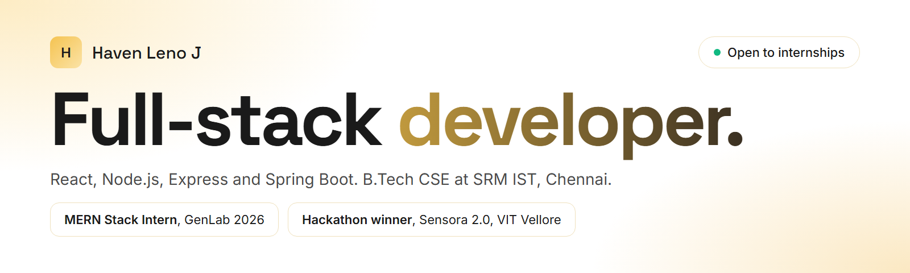
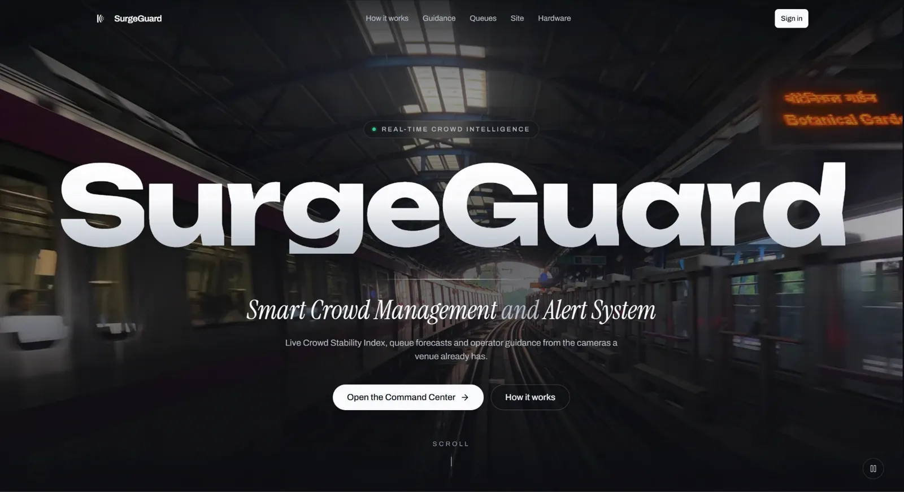
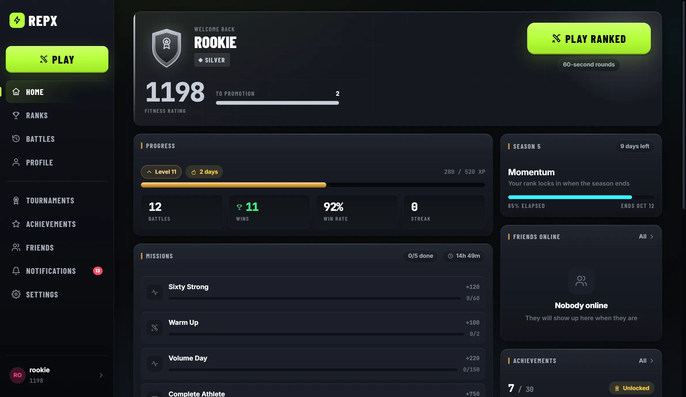
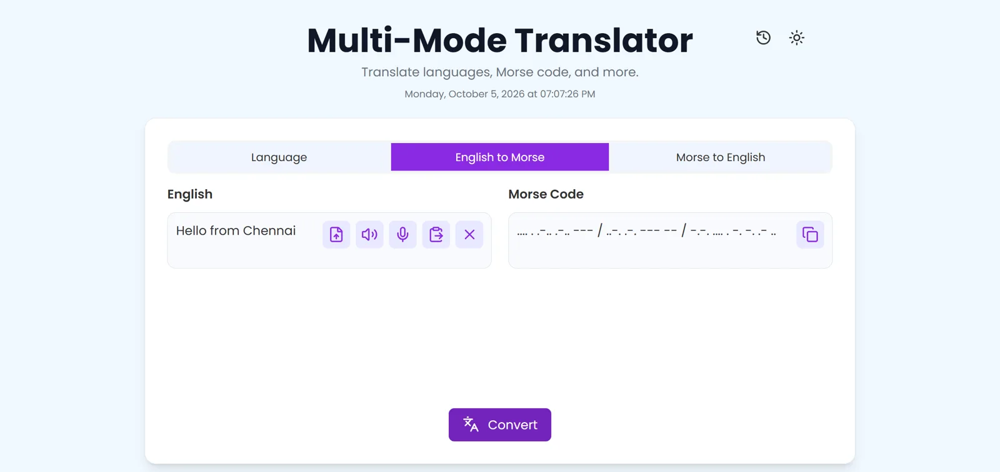

I'm a third-year B.Tech Computer Science and Engineering student at SRM Institute of Science
and Technology, Chennai. I build web apps end to end, from the database and API to the
interface, mostly with React, Node.js and Spring Boot.

- **Internship:** MERN Stack Developer Intern at GenLab, June to August 2026
- **Hackathon:** Winner, Implementation Category at Sensora 2.0, graVITas '26, VIT Vellore, with SurgeGuard
- **Now:** looking for software engineering internships

**[See my portfolio](https://havenleno22.github.io/)**

## Featured projects

<table>
  <tr>
    <td width="33%" valign="top">
      
      <h3><a href="https://github.com/HavenLeno22/surgeguard-crowd-safety">SurgeGuard</a></h3>
      Real-time crowd safety. Tracks people in camera feeds and scores crowd stability from 0 to 100, with alerts for security staff and an Arduino alarm.
        Python, YOLO, FastAPI, WebSockets, React, Arduino
       <b>Winner, Sensora 2.0</b>. <a href="https://havenleno22.github.io/#/project/surgeguard">Case study</a>
    </td>
    <td width="33%" valign="top">
      
      <h3><a href="https://github.com/HavenLeno22/RepX">RepX</a></h3>
      Live 1v1 fitness battles. Pose estimation in the browser counts only valid reps, and results move your ELO rating like chess.
        React, TypeScript, NestJS, Socket.IO, Prisma, MediaPipe
       <a href="https://havenleno22.github.io/#/project/repx">Case study</a>
    </td>
    <td width="33%" valign="top">
      
      <h3><a href="https://github.com/HavenLeno22/multi-mode-ai-translator">Multi-Mode AI Translator</a></h3>
      Translation between 21 languages with the Gemini API, Morse code with a tap pad, and voice input.
        Python, Flask, Gemini API, Web Speech API
       Team project. <a href="https://havenleno22.github.io/#/project/multi-mode-ai-translator">Case study</a>
    </td>
  </tr>
</table>

## More projects

| Project | What it does | Built with |
| --- | --- | --- |
| [Anatomix AI](https://github.com/HavenLeno22/anatomix-ai) ([live](https://havenleno22.github.io/anatomix-ai/)) | 3D anatomy learning: organs, body systems, diseases and quizzes (work in progress) | React, Three.js |
| [HealthSys EMR](https://github.com/HavenLeno22/healthsys-emr) ([live](https://havenleno22.github.io/healthsys-emr/)) | Hospital records prototype: patient charts, documents and scheduling (course project) | HTML, Tailwind CSS, JavaScript |
| [AgriTrace](https://github.com/HavenLeno22/agritrace) | Farm-to-fork supply-chain tracker, from the Hack To The Future hackathon | Node.js, Express, Gemini API |
| [StaffSync](https://github.com/HavenLeno22/staff-sync) | Employee-management dashboard with roles, charts and an audit log | Firebase, Chart.js, Tailwind CSS |
| [Student Expense Tracker](https://github.com/HavenLeno22/student-expense-tracker) | Income and spending by category with a running balance | React, Firebase |

## Stack

**Main:** React, Node.js, Express, MongoDB, Java, Spring Boot 
**Also used:** Python, FastAPI, Flask, TypeScript, Firebase, Tailwind CSS, WebSockets, Gemini API

## Contact

[Portfolio](https://havenleno22.github.io/) · [LinkedIn](https://www.linkedin.com/in/havenleno) · [Email](mailto:havenleno2006@gmail.com) · [LeetCode](https://leetcode.com/u/lenohaven/) · [Resume (PDF)](https://havenleno22.github.io/resume/Haven-Leno-J-Resume.pdf)
